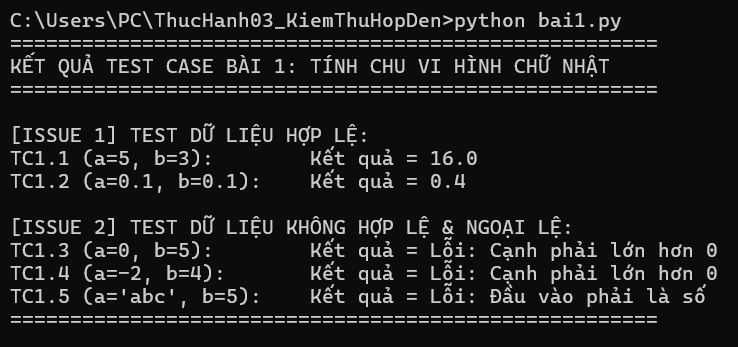
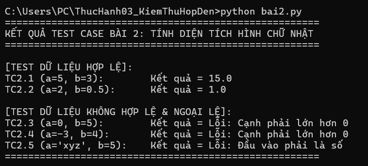
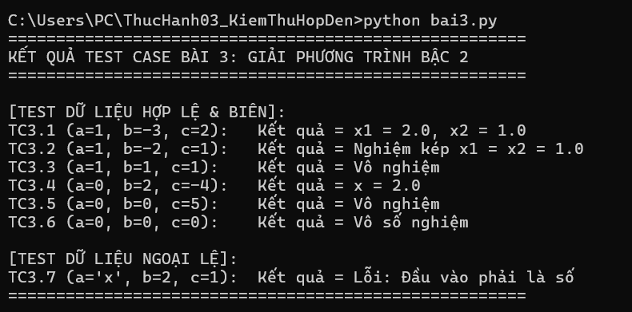
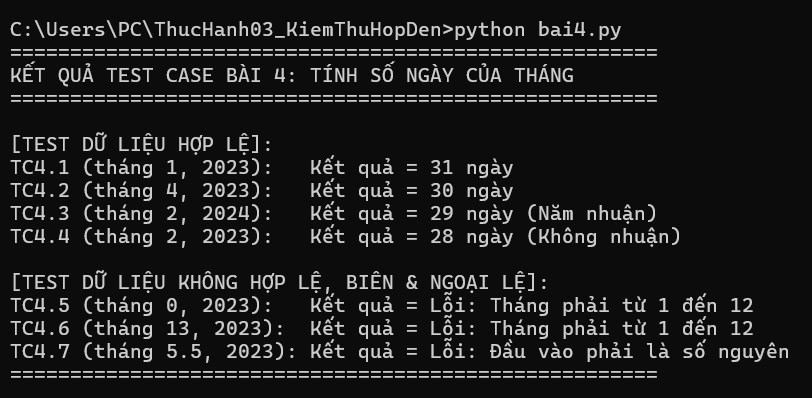
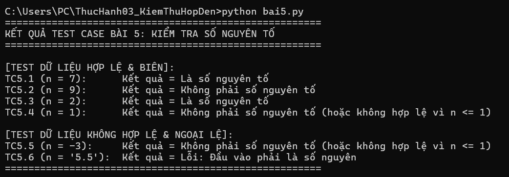
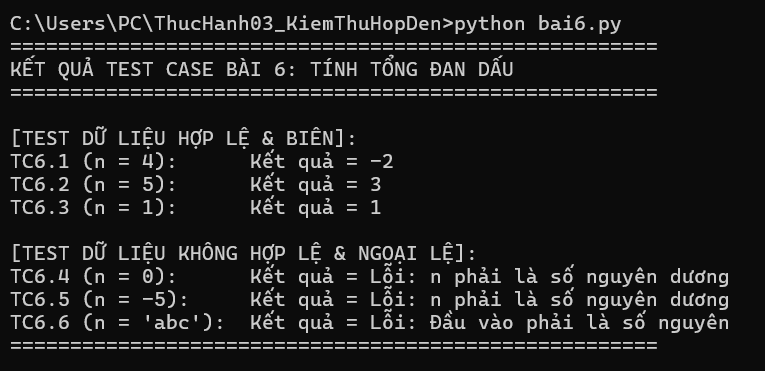
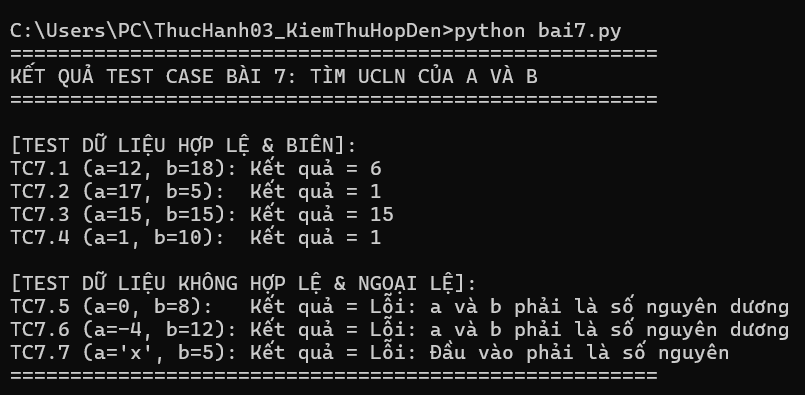
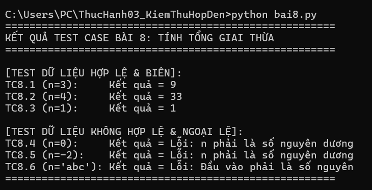

# Báo cáo Thực hành 03 - Kiểm thử Hộp đen

**Mô tả ngắn gọn:** 
Dự án này áp dụng phương pháp Phân lớp tương đương và Phân tích giá trị biên để thiết kế Test Case cho 8 bài toán. 

**1. Mã nguồn:** 
Gồm các file từ `bai1.py` đến `bai8.py` đã được đính kèm trong repository.

**2. Danh sách Test Case:** 
Chi tiết các ca kiểm thử hợp lệ, không hợp lệ, biên và ngoại lệ được trình bày đầy đủ trong file `TestCase.md`.

**3. Kết quả chạy kiểm thử:**

**Bài 1: Tính chu vi hình chữ nhật**

**Bài 2: Tính diện tích hình chữ nhật**

**Bài 3: Giải phương trình bậc 2**

**Bài 4: Tính số ngày của tháng**

**Bài 5: Kiểm tra số nguyên tố**

**Bài 6: Tính tổng đan dấu**

**Bài 7: Tìm UCLN của a và b**

**Bài 8: Tính tổng giai thừa**
